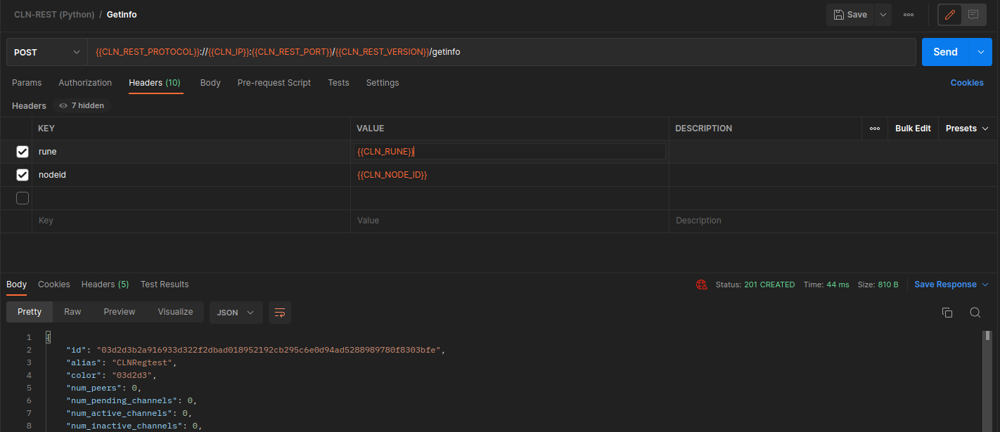
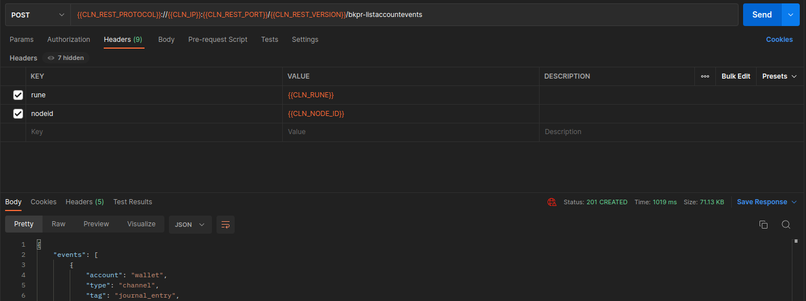

# CLNRest

CLNRest is a lightweight Python-based wrapper that transforms RPC calls into a REST service. By generating REST API endpoints, it enables the execution of Core Lightning's RPC methods behind the scenes and provides responses in JSON format.

CLNRest can function as a standalone server or as a plugin for Core Lightning.

## Installation

1: Create a virtual environment to avoid package dependencies and version conflicts, and to keep the global packages clean and manageable.

```
virtualenv venv
```
2: Activate the virtual environment

```
source venv/bin/activate
```
3: Install the necessary packages for the project

```
pip install -r requirements.txt 
```

For general installation instructions, please refer to the main README's [Installation](https://github.com/lightningd/plugins/blob/master/README.md#Installation) section.

## Configuration
- --rest_config_path: Specifies the path to the config file. Default is the present working directory (pwd).
- --rest_log_level: Determines the log level, options include DEBUG, INFO, WARNING, ERROR. Default is set to ERROR.
- --rest_rpc_path: Sets the path for the lightning-rpc file. Default path is /home/user/.lightning/bitcoin.
- --rest_certs_path: Defines the path for HTTPS certificates. If not specified, it uses gRPC's client certificates if available.
- --rest_protocol: Specifies the REST server protocol. Default is HTTPS.
- --rest_host: Defines the REST server host. Default is 127.0.0.1.
- --rest_port: Sets the REST server port to listen to. Default is 3010.

## Binary Executable Files

Python's library PyInstaller can be utilized to generate local binaries:

- For the standalone server:

```
pyinstaller --onefile --distpath ./release cln_rest.py
```

- For the plugin server:

```
pyinstaller --onefile --distpath ./release clnrest.py
```

## Execution

- The standalone server can be started with `python3 cln_rest.py` OR `./release/cln_rest` (if the executable from the previous step is available).

- The plugin can be run by adding `plugin=/<path>/clnrest/clnrest.py` OR `plugin=/<path>/release/clnrest` (if the executable from the previous step is available) to the Core Lightning's config file.

## Server

With the default configurations, the Swagger user interface will be available at https://127.0.0.1:3010/. The POST method requires `rune` and `nodeid` headers for authorization.

### Swagger
<p float="left">
    
    
    
    
</p>

### Postman
<p float="left">
    
    
    
</p>
